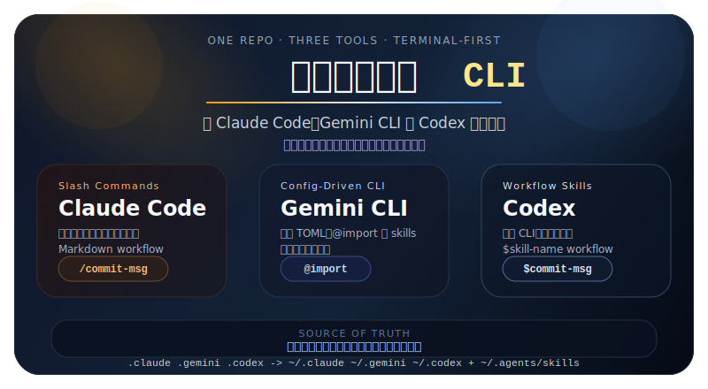
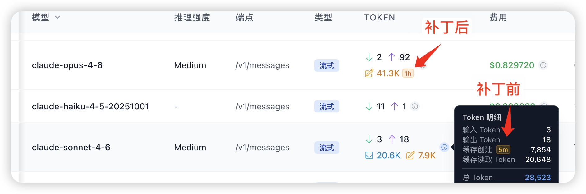
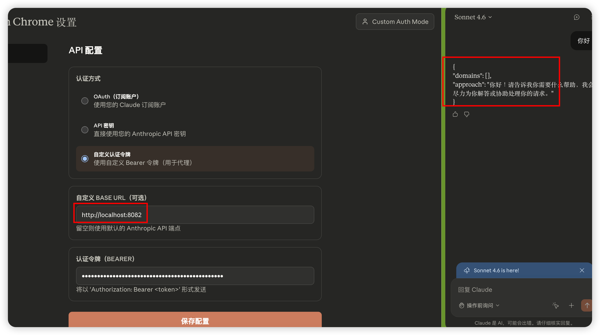
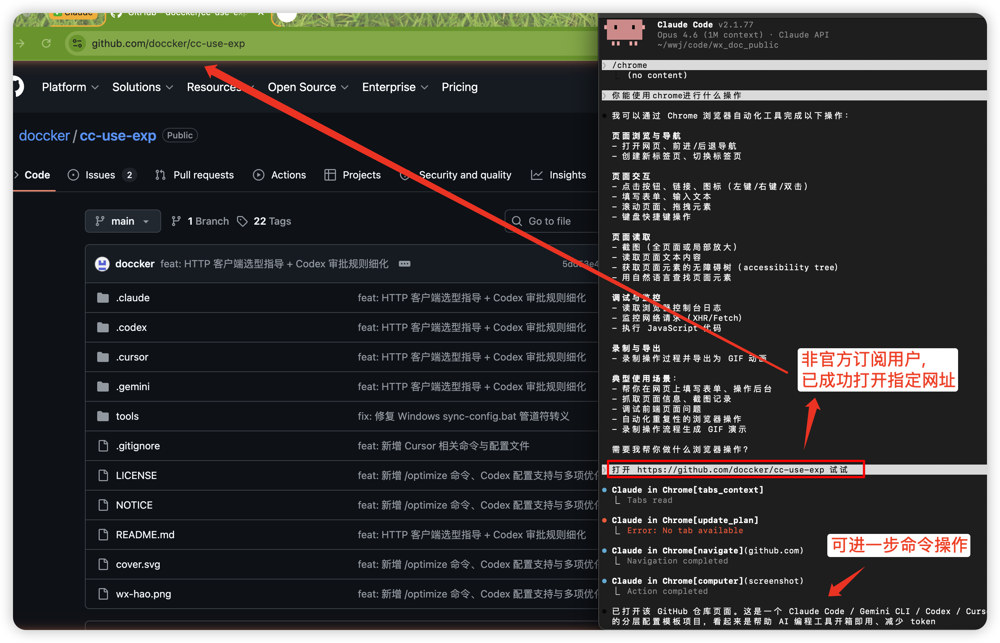
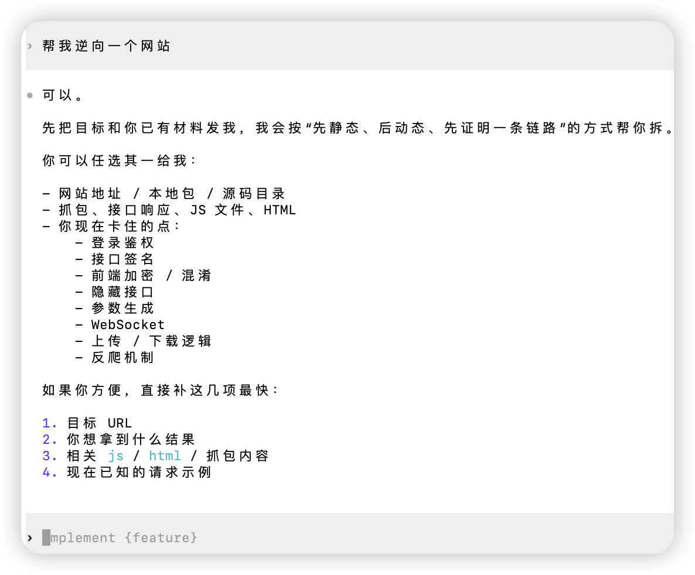

<div align="center">

# AI 编码助手配置体系

<!-- 封面图 -->


> 保留你熟悉的 CLI/IDE，让 Claude Code、Gemini CLI、Codex、Cursor、GitHub Copilot 开箱即用
>
> 按费力度从低到高，用最少操作获得最大帮助

[](https://github.com/doccker/cc-use-exp)
[](./LICENSE)
[](https://docs.anthropic.com/claude-code)
[](https://github.com/google-gemini/gemini-cli)
[](https://developers.openai.com/codex/)
[](https://www.cursor.com/)
[](https://github.com/doccker/cc-use-exp/pulls)
[](https://github.com/doccker/cc-use-exp/stargazers)
[](https://github.com/doccker/cc-use-exp/network)
[](https://github.com/doccker/cc-use-exp/watchers)

</div>

---

> 不是提示词集合，而是一套可维护的 AI 协作配置系统。

## 适合谁

- 同时使用 Claude Code、Gemini CLI、Codex、Cursor、GitHub Copilot 中的一种或多种 CLI/IDE
- 不想在每个 session 里重复交代技术栈、项目结构和编码规范
- 希望把团队协作方式沉淀成可维护的 rules、skills 和 workflow
- 想降低 AI 常见翻车和危险操作风险

## 核心收益

- 一次维护，五套工具分别同步到各自用户级入口
- 分层加载（rules 常驻 + skills 按需 + workflow 显式调用），减少常驻上下文负担
- 内置防御性规则，降低修改测试适配错误、危险命令、过度重构等常见问题
- 保留你熟悉的 CLI，不强迫切换到新的交互方式

本项目的重点不是继续堆更长的提示词，而是把长期会反复出现的协作约定拆成可维护的结构：全局原则、审批规则、语言技能和任务 workflow 各司其职。

## 常见协作失效模式

一些高频问题并不是业务逻辑复杂，而是前后端接口契约已经漂移，却被临时兼容掩盖了。例如：

- 列表接口返回数组，前端却按分页对象读取
- 筛选项接口返回空数组，但列表里的真实数据明明存在对应状态
- 列表修好了，详情接口或状态选项接口仍然沿用另一套返回格式

这类问题的根因通常不是“前端容错不够”，而是后端没有遵守项目统一成功响应格式，或列表、详情、选项接口各自返回了不同结构。为减少这类问题在不同项目里反复出现，建议把治理拆成三层：

- 全局原则：联调异常先核对接口契约，不默认以前端兼容掩盖后端失配
- 专项 skill：通过 `cc-api-contract-safety` 检查成功响应包装、分页结构、筛选项来源和临时兼容退出条件
- workflow 持久化：在任务模板中记录接口契约确认和兼容清理条件，避免“先兼容，后遗忘”

---

## 快速部署

### 方式 A: 一键安装（推荐）

#### Claude Code

**方式 1：Plugin Marketplace**（推荐，一键安装）

在 Claude Code 会话中执行：
```bash
/plugin marketplace add doccker/cc-use-exp
/plugin install cc-use-exp@cc-use-exp
```

> 💡 **完全自动化**：无需手动下载，Claude Code 会自动从 GitHub 克隆并安装

更新配置：
```bash
/plugin update cc-use-exp@cc-use-exp
```

**方式 2：完整同步**（需要先安装方式 1）

安装方式 1 后，可使用自定义命令进行更完整的同步：
```bash
/skill-install
```

> 💡 **区别**：方式 1 仅安装 skills + commands，方式 2 额外同步 rules + templates，并支持跨工具使用（Gemini/Codex/Cursor）

更新配置：
```bash
/skill-update
```

**两种方式对比**：

| 特性 | 方式 1：Plugin Marketplace | 方式 2：完整同步 |
|------|---------------------------|-----------------|
| 前置条件 | 无 | 需要先安装方式 1 |
| 安装命令 | `/plugin marketplace add` + `/plugin install` | `/skill-install` |
| 同步内容 | skills + commands | rules + skills + commands + templates |
| 跨工具支持 | ❌ 仅 Claude Code | ✅ 支持 Gemini/Codex/Cursor |
| 更新方式 | `/plugin update` | `/skill-update` |
| 适用场景 | 仅需 Claude Code 扩展 | 需要完整配置体系 |

#### Codex CLI

**方式 1：会话内安装**（推荐）

在 Codex 会话中执行：
```bash
$skill-installer install https://github.com/doccker/cc-use-exp/.codex/skills/cc-skill-installer 
```

更新配置：重新执行上述命令

**方式 2：Shell 脚本**（无需进入 Codex 会话）

在终端执行：
```bash
bash <(curl -sL https://raw.githubusercontent.com/doccker/cc-use-exp/main/tools/install-codex.sh)
```

> **说明**：
> - 方式 1 需要在 Codex 会话中执行，适合已经在使用 Codex 的用户
> - 方式 2 可以在任何终端执行，无需进入 Codex 会话

#### Gemini CLI

在终端执行：
```bash
bash <(curl -sL https://raw.githubusercontent.com/doccker/cc-use-exp/main/tools/install-gemini.sh)
```

更新配置：重新运行安装脚本

#### Cursor

在终端执行：
```bash
bash <(curl -sL https://raw.githubusercontent.com/doccker/cc-use-exp/main/tools/install-cursor.sh)
```

更新配置：重新运行安装脚本

#### GitHub Copilot

在终端执行：
```bash
bash <(curl -sL https://raw.githubusercontent.com/doccker/cc-use-exp/main/tools/install-copilot.sh)
```

更新配置：重新运行安装脚本

---

### 方式 B: 手动同步（开发者）

**macOS/Linux**：
```bash
git clone https://github.com/doccker/cc-use-exp.git
cd cc-use-exp
./tools/sync-config.sh
```

**Windows**：
```cmd
git clone https://github.com/doccker/cc-use-exp.git
cd cc-use-exp
tools\sync-config.bat
```

脚本会自动同步五套配置：

- `.claude/` → `~/.claude/`
- `.gemini/` → `~/.gemini/`
- `.codex/global/AGENTS.md` → `~/.codex/AGENTS.md`（受管区块合并）
- `.codex/global/rules/` → `~/.codex/rules/`
- `.codex/instructions/*.md` → `~/.codex/instructions/`
- `.codex/skills/` → `~/.agents/skills/`
- `.codex/profiles/*.toml` → `~/.codex/config.toml`（受管区块合并）
- `.cursor/rules/*.mdc` → `~/.cursor/rules/`（兼容性同步，项目内 `.cursor/rules/` 仍是主路径）
- `.cursor/skills/*` → `~/.cursor/skills/`
- `.cursor/commands/*.md` → `~/.cursor/skills/{name}/SKILL.md`（命令式技能兼容层）
- `.cursor/templates/*` → `~/.cursor/templates/`
- `.github/copilot-instructions.md` → `~/.github/copilot-instructions.md`
- `.github/instructions/*.instructions.md` → `~/.github/instructions/`
- 本地 `AGENTS.md`（若仓库存在）→ `~/.github/AGENTS.md`

其中 Codex 采用**增量部署**：

- 不会整体覆盖 `~/.codex/`
- 不会动 `auth.json`、`history.jsonl`、日志、sqlite、cache 等运行态文件
- 只维护当前项目负责的 `AGENTS` 受管区块、受管 profiles、`rules`、`instructions` 和 `skills`

各工具的部署特性：

- **Claude Code**：同步到 `~/.claude/`，并保留历史对话记录和个人配置
- **Gemini CLI**：同步到 `~/.gemini/`，并保留认证信息（如 `oauth_creds.json`）和运行时数据
- **Codex**：对 `~/.codex/AGENTS.md` 和 `~/.codex/config.toml` 使用受管区块合并；增量管理 `~/.codex/rules/`、`~/.codex/instructions/` 与 `~/.agents/skills/` 下当前项目同步出去的受管内容；不改用户已有默认模型、provider 或 `base_url`
- **Cursor**：项目内 `.cursor/rules/` 仍是主路径；脚本会把 skills、templates 和命令式技能兼容层同步到用户级目录，并将 `.cursor/rules/*.mdc` 兼容性同步到 `~/.cursor/rules/`；保留 `~/.cursor` 下的 settings、extensions、cache 等运行态文件

---

## 支持的工具

| 工具 | 配置目录 | 部署位置 | 安装方式 | 状态 |
|------|---------|---------|---------|------|
| Claude Code | `.claude/` | `~/.claude/` | 会话内或 Plugin | ✅ 完整支持 |
| Codex | `.codex/` | `~/.codex/` + `~/.agents/skills/` | 会话内或 Shell | ✅ 完整支持（增量部署） |
| Gemini CLI | `.gemini/` | `~/.gemini/` | Shell 脚本 | ✅ 完整支持 |
| Cursor | `.cursor/` | 项目内 + 用户级 | Shell 脚本 | ✅ 完整支持 |
| GitHub Copilot | `.github/` + 可选本地 `AGENTS.md` | `~/.github/` + 仓库内 | Shell 脚本 | ✅ 新增支持 |

**安装方式详情**：

<details>
<summary><strong>Claude Code</strong></summary>

- **方式 1**：Plugin Marketplace `/plugin install`（推荐）
  - 一键安装，无需手动下载
  - 同步 skills + commands
- **方式 2**：完整同步 `/skill-install`
  - 需要先安装方式 1
  - 额外同步 rules + templates
  - 支持跨工具使用（Gemini/Codex/Cursor）
  </details>

<details>
<summary><strong>Codex</strong></summary>

- **方式 1**：会话内安装 `$skill-installer install`
  - 在 Codex 会话中执行
- **方式 2**：Shell 脚本
  - 可在任何终端执行
  - 无需进入 Codex 会话
  </details>

<details>
<summary><strong>Gemini CLI / Cursor / GitHub Copilot</strong></summary>

- **Shell 脚本安装**
  - Gemini：`bash <(curl -sL https://raw.githubusercontent.com/doccker/cc-use-exp/main/tools/install-gemini.sh)`
  - Cursor：`bash <(curl -sL https://raw.githubusercontent.com/doccker/cc-use-exp/main/tools/install-cursor.sh)`
  - GitHub Copilot：`bash <(curl -sL https://raw.githubusercontent.com/doccker/cc-use-exp/main/tools/install-copilot.sh)`
  </details>


---

## 项目定位

### 使用架构

```
本项目                      用户目录                               其他项目
├── .claude/  ──覆盖──>    ~/.claude/  <──读取──                 .claude/ (空)
├── .gemini/  ──覆盖──>    ~/.gemini/  <──读取──                 .gemini/ (空)
├── .codex/   ──增量部署──> ~/.codex/ + ~/.agents/skills/ <──读取── .codex/ (空)
├── .cursor/  ──项目内 rules + 用户级兼容同步──> ~/.cursor/skills/ + ~/.cursor/templates/ <──读取── .cursor/ (空)
└── .github/ + 可选本地 AGENTS.md ──覆盖/兜底──> ~/.github/ <──读取── .github/ + 本地 AGENTS.md
```

- **本项目**：配置开发/维护环境，不参与实际业务开发
- **用户目录**：实际生效的配置
- **其他项目**：配置目录为空，自动使用用户目录配置

### 四套配置的关系

| 目录 | 服务对象 | 说明 |
|------|---------|------|
| `.claude/` | Claude Code | Anthropic 的 CLI 工具 |
| `.gemini/` | Gemini CLI | Google 的 CLI 工具 |
| `.codex/` | Codex | OpenAI 的 CLI 工具，项目内维护权威源，部署时分发到 `~/.codex/` 和 `~/.agents/skills/` |
| `.github/` + 可选本地 `AGENTS.md` | GitHub Copilot | GitHub Copilot / coding agent 的仓库级配置；若项目本地存在 `AGENTS.md`，可作为额外兜底配置 |
| `.cursor/` | Cursor | AI IDE，项目内 `.cursor/rules/` 为主；用户级复用 `~/.cursor/skills/`、`~/.cursor/templates/`，并兼容性同步 `~/.cursor/rules/` |

**四者相互独立**：
- Claude Code 只读取 `~/.claude/`，不读取 `~/.gemini/`
- Gemini CLI 只读取 `~/.gemini/`，不读取 `~/.claude/`
- Codex 的全局入口是 `~/.codex/AGENTS.md`、`~/.codex/rules/`、`~/.codex/instructions/` 和 `~/.agents/skills/`
- Cursor 以当前项目 `.cursor/rules/` 为主；跨项目复用的技能和命令式技能主要通过 `~/.cursor/skills/` 提供
- 配置内容可能相似（如禁止行为、技术栈偏好），但这不是重复，而是各自需要的独立配置

### 配置能力差异

| 特性 | Claude Code | Gemini CLI | Codex | Cursor |
|------|-------------|------------|-------|--------|
| 主配置文件 | `.claude/CLAUDE.md` | `.gemini/GEMINI.md` | `.codex/global/AGENTS.md` → `~/.codex/AGENTS.md` | 无（规则即配置） |
| 规则目录 | `.claude/rules/` ✅ | `.gemini/rules/` ✅（通过 @import） | `.codex/global/rules/` → `~/.codex/rules/` | `.cursor/rules/` ✅（.mdc 格式） |
| 技能目录 | `.claude/skills/` ✅ | `.gemini/skills/` ✅（v0.24.0+） | `.codex/skills/` → `~/.agents/skills/` | `.cursor/skills/` ✅ |
| 命令目录 | `.claude/commands/` (.md) | `.gemini/commands/` (.toml) | 无独立命令目录，使用显式 workflow skills | `.cursor/commands/` (.md) |
| 命令格式 | Markdown | TOML | `SKILL.md` + `agents/openai.yaml` | Markdown（部署为 SKILL.md） |

**规则同步方式**：
- Claude Code：规则拆分到 `rules/` 目录，按文件组织；技能放 `skills/` 按需加载
- Gemini CLI：核心规则在 `GEMINI.md`；详细规范通过 `skills/` 按需激活（v0.24.0+）
- Codex：全局仅保留极薄 `AGENTS.md` 和审批 `rules`；绝大多数通用规范放进 `skills`，通过渐进式披露按需加载
- Cursor：规则用 `.mdc` 格式支持 `alwaysApply` / `globs` / 智能匹配；技能通过 `description` 语义匹配按需加载；用户级 `~/.cursor/rules/` 同步仅作为兼容性补充

> 如需在多个工具间同步规则（如禁止行尾注释），需分别在 `.claude/rules/bash-style.md`、`.gemini/GEMINI.md`、`.cursor/rules/bash-style.mdc` 中维护。

---

# Part 1: Claude Code 配置

> 📖 **[完整指南](./docs/guides/claude-code.md)** - Rules、Skills、Commands 详解、最佳实践、常见问题

<div align="center">

</div>

> 上图展示从 `claude` 命令输入到 Sonnet 模型输出的完整链路：① 启动加载 `settings.json` + `CLAUDE.md` + `~/.claude/rules/*.md`（cc-use-exp 防御性规则始终注入），② Skills 渐进式披露（描述常驻、命中后加载完整 SKILL.md），③ `/slash` 命令显式触发 workflow，PostToolUse Hook 守卫落盘。

---

## 快速开始

### 零费力（自动生效）- Rules

这些规则始终自动加载，在后台默默保护你：

- **防御性规则**：防止测试篡改、过度工程化、中途放弃
- **文件行数限制**：超限时自动警告，提供简化选项
- **运维安全**：危险命令确认、回滚方案、风险提示
- **文档同步**：配置变更时提醒更新文档
- **Bash 规范**：禁止行尾注释等核心规范

### 低费力（自动触发）- Skills

操作相关文件时自动加载对应的开发规范：

- **语言技能**：`go-dev`、`java-dev`、`frontend-dev`、`python-dev`
- **安全技能**：`ops-safety`、`redis-safety`、`api-design-safety`、`api-contract-safety`、`storage-url-safety`
- **重构技能**：`refactor-safety`、`field-mapping-safety`
- **工具技能**：`bash-style`、`size-check`

### 中费力（显式调用）- Commands

输入 `/命令名` 执行工作流：

**高频命令**：`/fix`、`/review`、`/review quick`、`/commit-msg`

**中频命令**：`/optimize`、`/new-feature`、`/design`、`/requirement`

**低频命令**：`/skill-install`、`/skill-update`、`/skill-uninstall`、`/project-init`、`/patch`、`/status`

---

## 补丁工具

`/cache-patch` 验证效果：



注：`/patch` 只是让 CC 绕过 Chrome 订阅检查。如需要自定义渠道的插件，可以扫码联系作者免费获取插件地址，仅供学习使用。



Claude Code 联动 Chrome 扩展效果图：



---

## 推荐插件

本项目通过 `.claude/plugins.json` 声明了推荐的插件：

- `context7` - 精准第三方库文档查询
- `frontend-design` - 生成高质量前端界面代码
- `gopls-lsp` / `jdtls-lsp` / `pyright-lsp` / `typescript-lsp` - 语言 LSP 支持
- `superpowers` - 结构化开发框架
- `code-review` - 多审查者代码审查

**安装方式**：运行 `./tools/sync-config.sh`，脚本会自动检测缺失的插件并引导你一键安装。

---

# Part 2: Gemini CLI 配置（前端设计）

> 📖 **[完整指南](./docs/guides/gemini-cli.md)** - 前端场景速查、UI 风格约束、Vue 组件规范、MCP 工具使用

<div align="center">

</div>

> 上图展示从 `gemini` 命令输入到 Gemini 3 模型输出的完整链路：① `GEMINI.md` 分层拼接（Global → Project → 子目录 JIT），通过 `@import` 注入 cc-use-exp 的 5 个 rules 文件；② Agent Skills（v0.24+）调用 `activate_skill` 工具弹确认后加载完整 SKILL.md；③ TOML Commands（如 `/layout`）和 Extensions（context7、chrome-devtools-mcp）显式介入。

---

## 快速开始

### 零费力（自动生效）- GEMINI.md

GEMINI.md 自动加载，提供以下保护：

- **UI 风格约束**：禁止霓虹渐变、玻璃拟态、赛博风
- **代码质量**：完整实现，禁止 MVP/占位/TODO
- **中文交流**：统一使用中文回复和注释
- **MCP 工具指南**：规范工具调用，避免滥用

### 低费力（自动触发）- Skills

操作相关文件时自动加载对应的开发规范：

- **前端技能**：`frontend-safety`（数据绑定保护、布局一致性）
- **语言技能**：`go-dev`、`java-dev`、`python-dev`
- **安全技能**：`ops-safety`、`api-design-safety`、`api-contract-safety`、`storage-url-safety`
- **工具技能**：`bash-style`

### 中费力（显式调用）- Commands

输入 `/命令名` 执行工作流：

**前端专用**：`/layout`、`/layout-check`、`/vue-split`、`/patch-http`

**通用命令**：`/fix`、`/debug`、`/code-review`、`/quick-review`、`/commit-msg`

---

## 推荐扩展

本项目通过 `.gemini/extensions.json` 声明了推荐的扩展：

- `context7` - 精准第三方库文档查询
- `chrome-devtools-mcp` - 前端页面真机调试、Lighthouse 审计

**安装方式**：运行 `./tools/sync-config.sh`，脚本会自动检测缺失的扩展并引导你一键安装。

---

# Part 3: Codex 配置

> 📖 **[完整指南](./docs/guides/codex.md)** - 渐进式 Skills 配置、Profile 切换、审批规则、最佳实践

<div align="center">

</div>

> 上图展示从 `codex -p cc-balanced` 启动到 GPT-5.3-Codex 输出的完整链路：① `AGENTS.md` 链按 root → cwd 顺序合并（max 32 KiB），cc-use-exp 通过受管区块写入 `~/.codex/AGENTS.md` 与 `~/.codex/config.toml`，不动用户 auth/history；② Skills 渐进式披露（初始列表 ≤ 2% 上下文，命中后加载完整 SKILL.md）；③ Workflow Skills 通过 `$` 前缀显式触发，任务持久化到 `.codex/tasks/`。

---

## 快速开始

### 一键安装

**方式 1：会话内安装**

在 Codex 会话中执行：
```bash
$skill-installer install https://github.com/doccker/cc-use-exp/.codex/skills/cc-skill-installer
```

**方式 2：Shell 脚本**

在终端执行：
```bash
bash <(curl -sL https://raw.githubusercontent.com/doccker/cc-use-exp/main/tools/install-codex.sh)
```

### 零费力（自动生效）- Global AGENTS + Rules

同步配置后自动生效：

- **Global AGENTS**：极薄全局原则（先读代码、最小改动、验证、分层）
- **Rules**：审批与危险命令控制
- **Profiles**：`cc-fast-api`、`cc-balanced`、`cc-deep`、`cc-custom-instructions`

### 低费力（自动触发）- Skills

操作相关文件时自动加载对应的开发规范：

- **语言技能**：`go-dev`、`java-dev`、`frontend-dev`、`python-dev`
- **安全技能**：`ops-safety`、`redis-safety`、`api-design-safety`、`api-contract-safety`、`storage-url-safety`
- **重构技能**：`refactor-safety`、`field-mapping-safety`
- **工具技能**：`bash-style`、`size-check`

### 中费力（显式调用）- Workflow Skills

输入 `$workflow-name` 执行工作流：

**高频工作流**：`$fix`、`$review`、`$commit-msg`

**中频工作流**：`$optimize`、`$new-feature`、`$design`、`$requirement`、`$cc-task-state`

**低频工作流**：`$skill-update`、`$project-init`、`$project-scan`、`$status`

兼容入口：`$cc-project-init` 等价于 `$project-init`，用于照顾按 cc-use-exp 前缀调用的习惯。

项目级任务状态默认持久化到当前项目的 `.codex/tasks/`：

- `$project-init` 用于生成项目级 `AGENTS.md`，并补齐项目级 `.codex` 最小骨架
- `$project-scan` 用于扫描当前项目，生成或刷新项目级 `AGENTS.md` / `README.md`
- `$new-feature` 用于完整功能开发与任务推进
- `$cc-task-state` 用于沉淀“还没开始 / 被打断 / 待恢复”的任务状态，避免进展只留在对话里

使用 `codex -p cc-custom-instructions`


### 大陆网络下 `gpt` 频繁 `reconnecting`

如果你在大陆网络环境下使用 Codex，并且在 `gpt` 会话里频繁看到 `reconnecting`，可以先尝试为 Codex 增加代理环境变量。

仓库已提供可直接参考的模板文件：[`.codex/.env`](./.codex/.env)

```env
HTTP_PROXY="http://127.0.0.1:7897"
HTTPS_PROXY="http://127.0.0.1:7897"
NO_PROXY="localhost,127.0.0.1"
```

使用方式：

- 按你的本地代理实际端口修改 `127.0.0.1:7897`
- 复制到 `~/.codex/.env`，让其他项目也能复用这份全局配置
- 如果你只想对单个项目生效，也可以放到该项目的 `.codex/.env`

> **说明**：
> - 这份 `.env` 是模板，不会被 `tools/sync-config.sh` 自动同步到 `~/.codex/.env`
> - 这样做是为了避免覆盖用户已有的机器本地代理配置
> - 该方案来自实际使用验证，适合先作为网络层排查手段


---

# Part 4: Cursor 配置

> 📖 **[完整指南](./docs/guides/cursor.md)** - Rules 配置、Skills 语义匹配、Commands 使用、最佳实践

<div align="center">

</div>

> 上图展示从 Cursor Chat（⌘L）输入到 Cursor Agent 输出的完整链路：① 优先级 Team → Project → User，cc-use-exp 在 `.cursor/rules/` 提供 6 个 `.mdc` 文件；② `.mdc` Frontmatter 决定加载方式：`alwaysApply` 始终生效（defensive）、`globs` 文件匹配（ops-safety）、`description` 由 Agent 语义匹配；③ Skills 通过 description 自动激活，Commands 通过 `/` 显式触发，仅作用于 Agent / Inline Edit。

---

## 快速开始

### 一键安装

在项目根目录执行：

- **macOS/Linux**: `./tools/sync-config.sh`
- **Windows**: `tools\sync-config.bat`

### 零费力（自动生效）- Rules

项目内 `.cursor/rules/` 中的规则会自动生效：

- **Always Apply**：`defensive.mdc`（防止测试篡改、过度工程化）
- **Glob 匹配**：`ops-safety.mdc`、`bash-style.mdc`、`doc-sync.mdc`、`file-size-limit.mdc`

### 低费力（自动触发）- Skills

Cursor Agent 根据 `description` 语义匹配，自动加载对应技能：

- **语言技能**：`go-dev`、`java-dev`、`frontend-dev`、`python-dev`
- **安全技能**：`ops-safety`、`redis-safety`、`api-design-safety`、`api-contract-safety`、`storage-url-safety`
- **重构技能**：`refactor-safety`、`field-mapping-safety`
- **工具技能**：`bash-style`、`size-check`、`ruanzhu`、`ui-ux-pro-max`

### 中费力（显式调用）- Commands

在 Cursor 对话中输入 `/命令名`：

**高频命令**：`/fix`、`/review`、`/commit-msg`

**中频命令**：`/new-feature`、`/design`、`/requirement`、`/optimize`、`/style-extract`

**低频命令**：`/skill-update`、`/project-init`、`/status`

---

# Part 5: GitHub Copilot 配置

> 📖 **完整指南**：本仓库 `.github/copilot-instructions.md` + `.github/instructions/*.instructions.md` + 仓库根 `AGENTS.md`

<div align="center">

</div>

> 上图展示从 VS Code Chat / Copilot CLI / Cloud Agent 输入到 Copilot 模型输出的完整链路：① 仓库级 `.github/copilot-instructions.md` 保存即生效（Personal > Repository > Organization 优先级）；② Path-specific `.github/instructions/*.instructions.md` 按 `applyTo` 字段匹配文件路径自动注入；③ 仓库根 `AGENTS.md` 由 Coding Agent 优先读取，作为兜底配置（可与 copilot-instructions.md 共存）。

---

## 快速开始

### 一键安装

在终端执行：
```bash
bash <(curl -sL https://raw.githubusercontent.com/doccker/cc-use-exp/main/tools/install-copilot.sh)
```

更新配置：重新运行安装脚本

### 零费力（自动生效）- copilot-instructions.md

`.github/copilot-instructions.md` 保存到仓库后立即生效，提供以下保护：

- **工作方式**：先读代码、最小改动、复用现有模式、不主动扩需求
- **质量要求**：错误行为/类型问题/缺失校验视为真实问题，不通过改测试掩盖错误实现
- **协作输出**：默认简体中文，作者署名统一为 `wwj`
- **分层引用**：语言/框架规范优先复用 `.codex/skills/`、`.claude/skills/`、`.cursor/skills/`

### 低费力（路径匹配）- Path-specific instructions

`.github/instructions/*.instructions.md` 按 `applyTo` 字段匹配文件路径自动注入：

- `general.instructions.md`：通用规范
- `frontend.instructions.md`：前端文件触发（Vue / TS / TSX）
- `java.instructions.md`：Java 文件触发（Spring Boot 规范）

> 💡 **支持范围**：Copilot Chat（VS Code / Visual Studio）+ Copilot Cloud Agent

### 中费力（兜底）- AGENTS.md

仓库根目录维护的 `AGENTS.md` 由 Copilot Coding Agent 优先读取，与 `copilot-instructions.md` 共存。Copilot CLI 还支持个人级 `~/.copilot/copilot-instructions.md`。

---

## 许可声明

本项目采用 **PolyForm Noncommercial 1.0.0** 许可证，仅授权非商业用途。

| 用途 | 说明 |
|------|------|
| ✅ 个人学习、研究、实验 | 可自由使用 |
| ✅ 学校、公益组织使用 | 可自由使用 |
| ❌ 企业内部生产使用 | 需商业授权 |
| ❌ 面向客户交付、SaaS 托管 | 需商业授权 |

商业授权咨询：`作者` | 详见 [LICENSE](./LICENSE)

### 联系作者


---

## Star History

[](https://star-history.com/#doccker/cc-use-exp&Date)

## Contributors

<a href="https://github.com/doccker/cc-use-exp/graphs/contributors">
  
</a>
